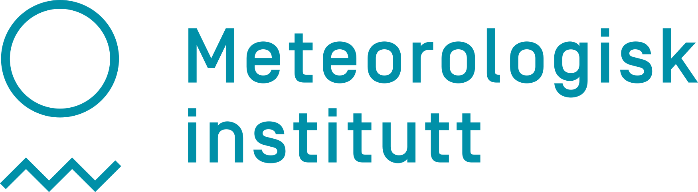

Performance evaluation of Arctic Weather Satellite data is an ESA funded
project (contract number 4000136511/21/NL/IA) spanning 4 years and kicked off
the 9th of December, 2021.

## Objectives

The over all objective of the project is to perform an early evaluation of the
Arctic Weather Satellite (AWS) data in the context of the regional Numerical
Weather Prediction (NWP) modelling systems of the Nordic countries.

In order to do a proper early evaluation of the data the NWP modelling systems
and the Direct Readout ground segment both needs to be well prepared by launch
to take in AWS data and make the most use of these "new" observations. In the
two and half years before launch the project has focused its efforts on just
that. A few more details on this work can be found under <a href="research.html">Research</a>.

## Team

Led by SMHI (the Swedish Meteorological and Hydrological Institute), we are a
team of 6 partners from the four Nordic countries of Finland, Denmark, Norway
and Sweden. In addition to the four National Meteoroligical Services (NMS's)
the team also include earth observation remote scientists from two
Universities, one in Denmark and one in Sweden:

 - [Met Norway](https://www.met.no/en/)
 - [FMI](https://en.ilmatieteenlaitos.fi/)
 - [DMI](https://www.dmi.dk/)
 - [Technical University of Denmark (DTU)](https://www.dtu.dk/en/)
 - [Chalmers University of Technology](https://www.chalmers.se/en/)
 - [SMHI](https://www.smhi.se/en/)

{: height="60"}
{: height="60"}
{: height="60"}
{: height="60"}
{: height="60"}
{: height="60"}
