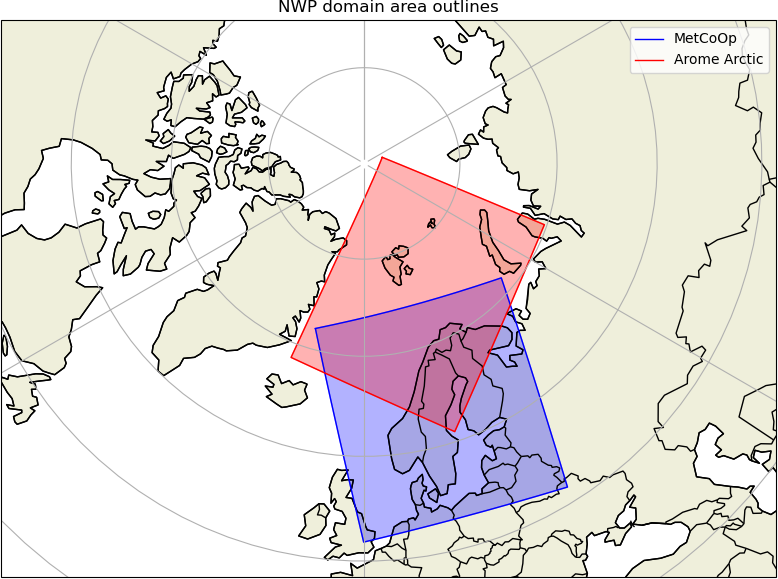

Performance evaluation of Arctic Weather Satellite data is an ESA funded
project (contract number 4000136511/21/NL/IA) spanning 4 years and kicked off
the 9th of December, 2021.

## Objectives

The over all objective of the project is to perform an early evaluation of the
Arctic Weather Satellite (AWS) data in the context of the regional Numerical
Weather Prediction (NWP) modelling systems of the Nordic countries.

The Nordic Meteorological Services of Sweden, Finland, Norway and Denmark,
operate regional Numerical Weather Prediction (NWP) models covering the Arctic
and high latitude Nordic region. All four Nordic institutes are part of the
ACCORD consortium, and as such share the same assimilation-code. SMHI, MET
Norway and FMI (all partners in the MetCoOp consortium) operate one and the
same model implementation covering the Scandinavian/Nordic domain. DMI operates
its model (together with Iceland) on a set of different domains covering
Denmark, as well as Iceland and Greenland (IGB model).

In this project the evaluation will be utilising the two domains shown below:

    

## Team

Led by SMHI (the Swedish Meteorological and Hydrological Institute), we are a
team of 6 partners from the four Nordic countries of Finland, Denmark, Norway
and Sweden. In addition to the four National Meteoroligical Services (NMS's)
the team also include earth observation remote scientists from two
Universities, one in Denmark and one in Sweden:

 - [SMHI](https://www.smhi.se/en/)
 - [Chalmers University of Technology](https://www.chalmers.se/en/)
 - [Met Norway](https://www.met.no/en/)
 - [DMI](https://www.dmi.dk/)
 - [Technical University of Denmark (DTU)](https://www.dtu.dk/en/)
 - [FMI](https://en.ilmatieteenlaitos.fi/)

