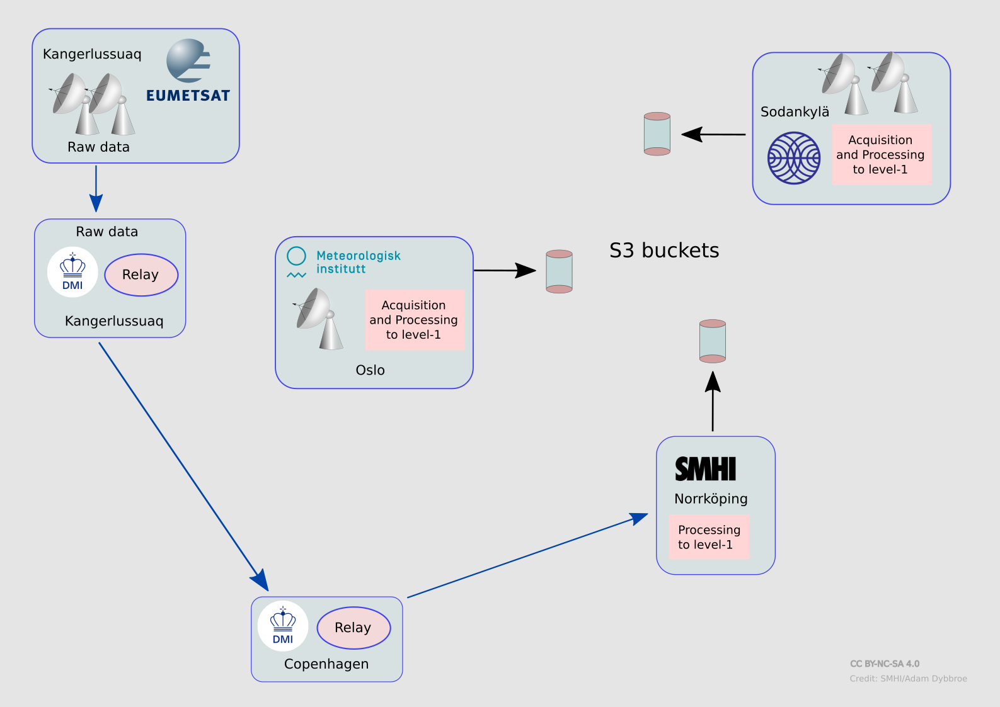

## The AWS ground segment and access to global data

As part of the ground segment setup under the industrial contract for ESA the
global AWS data, full orbits of stored mission data, are acquired in real-time
at Svalbard. The data are then sent to the <a
href="https://www.ksat.no/ground-network-services/satellite-operation/">KSAT
satellite operations center</a> in Tromsø, Norway, processed to level-1b, and
then sent further on to <a href="https://www.eumetsat.int">EUMETSAT</a> in
Darmstadt. EUMETSAT will then distribute the data over EUMETCast (Terrestrial),
first to NMSes of the EUMETSAT member states, and later to all EUMETCast
users. The timeliness of these global data is expected to be around 110
minutes.

## A Nordic Direct Broadcast ground segment providing real-time data

For <a href="about.html">this</a> project a direct broadcast ground segment has
been setup in collaboration with EUMETSAT (see the <a
href="https://zenodo.org/doi/10.5281/zenodo.10782613">Ground Segment
Development Plan</a>) covering Northern Europe and parts of the Arctic. AWS
data are received in real-time from the Direct Readout stations in
Greenland, Norway, Finland.

*Antenna horizons for a satellite at 600 km for the four Direct Readout
stations in the ground segment. This illustrating the approximate AWS data
coverage of the Nordic ground segment. The SMHI station in Norrköping is not
yet AWS compliant, and will be used only to compensate the Oslo station with
data from other satellites (JPSS) which has to be sacrificed there when
prioritising AWS.*

The Greenland data are sent via DMI in Copenhagen, Denmark, to SMHI in
Norrköping, Sweden for further processing. The data from the Oslo and Sodankylä
stations are processed locally. As all three stations have also other
commitments than AWS reception not all visible passes will be acquired.

It is expected that around 60% of the AWS passes visible from Kangerlussuaq
will be acquired. For the region covered by the Oslo and Sodankylä antennas AWS
reception efficiency will be higher, resulting in an expected overall 80% AWS
reception efficiency over the entire Nordic AWS ground segment.

{: width="800"}
*Schematic showing the flow of data and the distributed processing concept of
 the Nordic DB ground segment. Data will end up in three S3 buckets, one for
 each reception site. The raw data acquired in Kangerlussuaq will be sent to
 Copenhagen and uploaded in real-time for SMHI to process and disseminate.*

Data will be processed to level-1b (four geolocation datasets, one for each
feedhorn/group of channels) and level-1c (all data mapped to the 183 GHz grid).
The file format is netCDF/CF and inherrits as far as possible from the <a
href="https://user.eumetsat.int/s3/eup-strapi-media/pdf_epssg_mws_l1b_pfs_7204c74d3b.pdf">EUMETSAT EPS-SG
MWS file format</a>.
The average timeliness (from observation to level-1c) is expected to be better
than 15 minutes.

## Example - how to fetch data

To download processed Arctic Weather Satellite data from the three Nordic S3 buckets you
will need to get access/secret key pairs, one pair of keys for each
bucket. Also, of couse you need to know the URLs and the bucket names. For all
that, please contact us at: 

Below is an example of how to fetch the latest Level-1c data from the bucket at
SMHI (data received at Kangerlussuaq, Greenland) from a Linux terminal.

First set environment variables for the keys:



export SMHI_RO_AWS_ACCESS="<the access key you get from us>"
export SMHI_RO_AWS_SECRET="<the secret key you get from us>"



Then after adapting the path to where you store the AWS data locally you can
run the example python code below to download the last 6 hours of level-1c data
from the Kangerlussuaq station:



import os
import s3fs
from pathlib import Path
from trollsift import Parser
from datetime import datetime, timedelta

PATTERN = "W_XX-{centre:s}-{station:s},SAT,{satname:s}-{sensor:s}-{level:s}-RAD_C_{centre:s}_{processing_time:%Y%m%d%H%M%S}_G_D_{starttime:%Y%m%d%H%M%S}_{endtime:%Y%m%d%H%M%S}_T_B____.nc"

awsat_local_dir = '/some/path/to/my/local/aws/data/' # Please adapt to the choice of your own

s3 = s3fs.S3FileSystem(client_kwargs={
    'endpoint_url': 'https://satobjectstore.smhi.se/'},
                       anon=False,
                       key=os.environ["SMHI_RO_AWS_ACCESS"],
                       secret=os.environ["SMHI_RO_AWS_SECRET"])

all_esa_l1c_files = s3.ls('satellite-data-kangerlussuaq-arctic-weather-satellite/awsat/l1c/esa')

p__ = Parser(PATTERN)

now = datetime(2024, 1, 15, 12, 0)
tdelta = timedelta(hours=6) # Last six hours of data

for awsatfile_str in all_esa_l1c_files:
    awsatfile = Path(awsatfile_str)
    localpath = Path(awsat_local_dir) / awsatfile.name
    res = p__.parse(awsatfile.name)
    obstime = res['starttime']
    if (now - obstime) < tdelta:
        s3.get(awsatfile_str, str(localpath))


