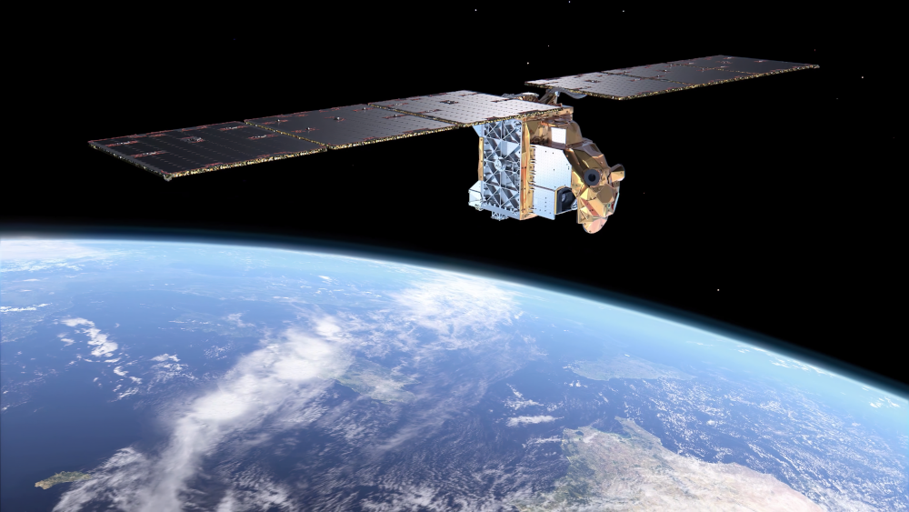

---
# Feel free to add content and custom Front Matter to this file.
# To modify the layout, see https://jekyllrb.com/docs/themes/#overriding-theme-defaults

layout: home
---

    

Photo: ©ESA

Performance evaluation of Arctic Weather Satellite data is an ESA funded
project spanning four years and kicked off the 9th of December, 2021.

The overarching goal of the project is to perform an early evaluation of the
Arctic Weather Satellite (AWS) data in the context of the regional Numerical
Weather Prediction (NWP) modelling systems of the Nordic countries.

## AWS?

The <a
href="https://www.esa.int/Applications/Observing_the_Earth/Meteorological_missions/Arctic_Weather_Satellite">Arctic Weather Satellite </a> (AWS) was launched into a sun-synchronous low earth
orbit (~595 km) on August 16, 2024. AWS is a small satellite build for the
European Space Agency (ESA). It carries a single instrument, a passive
microwave radiometer, measuring the upwelling radiance from the
earth-atmosphere system in 19 spectral channels (from around 50 to 325 GHz). 

The industrial team of 31 companies from 12 different countries is led by OHB
Sweden. OHB Sweden is the mission prime, platform provider and system
integrator. Omnisys instruments AB is the Instrument prime and Thales Alenia
Space provides the Ground Segment (incl. operations).

The AWS satellite, or the AWS-PFM (PFM=proto flight model), acts as a prototype
for a larger constellation of small satellites, the <a
href="https://www.eumetsat.int/eps-sterna">EPS-Sterna</a>
programme. EPS-Sterna, being developed by <a
href="https://www.eumetsat.int">the European Organisation for the Exploitation
of Meteorological Satellites (EUMETSAT)</a> and planned for decision 2025,
requires the manufacturing of 20 AWS satellites and is supposed to always fly
at least 6 satellites distributed over 3 orbital planes. Together with the IJPS
system (EPS-Metop and JPSS) EPS-Sterna will result in almost continous high
temporal MW data coverage globally, with a particular good coverage of the
Arctic and high latitudes. Coverage over Scandinavia will have a
time-to-coverage down to approximately 30 minutes over most of the day.

## Links

 - [Arctic Weather Satellite](https://www.esa.int/Applications/Observing_the_Earth/Meteorological_missions/Arctic_Weather_Satellite)
 - [AWS facts](https://esamultimedia.esa.int/docs/EarthObservation/Arctic_weather_satellite_factsheet2_240410.pdf)
 - [EPS-Sterna facts](https://www.eumetsat.int/media/51305)
 - [ESA](https://www.esa.int/)
 - [EUMETSAT](https://www.eumetsat.int/)

