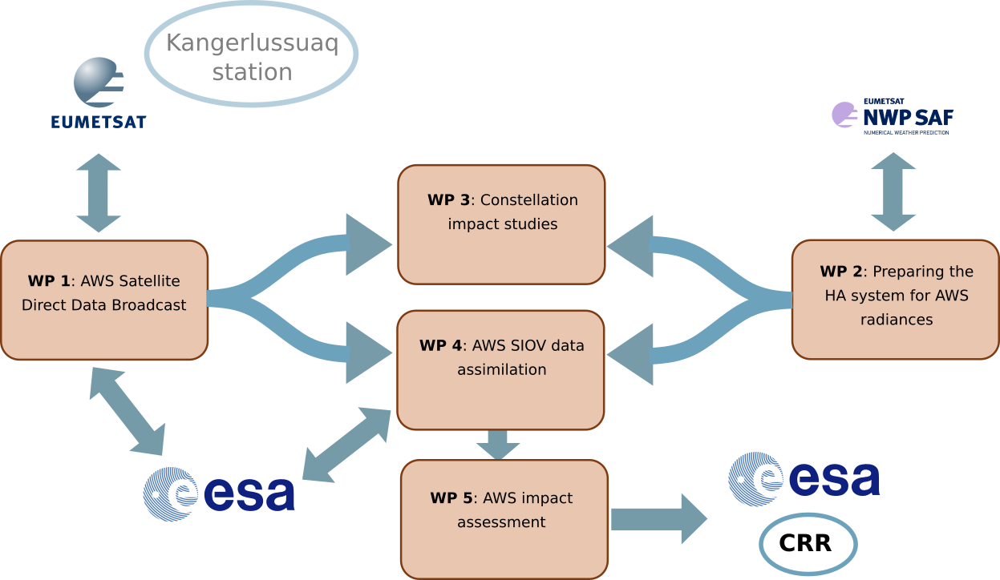
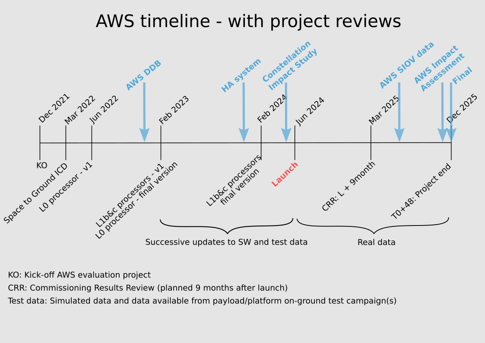

## Scope

The over all objective of the project is to perform an early evaluation of the
Arctic Weather Satellite (AWS) data in the context of the regional Numerical
Weather Prediction (NWP) modelling systems of the Nordic countries.

The Nordic Meteorological Services of Sweden, Finland, Norway and Denmark,
operate regional Numerical Weather Prediction (NWP) models covering the Arctic
and high latitude Nordic region. All four Nordic institutes are part of the
ACCORD consortium, and as such share the same assimilation-code. SMHI, MET
Norway and FMI (all partners in the MetCoOp consortium) operate one and the
same model implementation covering the Scandinavian/Nordic domain. DMI operates
its model (together with Iceland) on a set of different domains covering
Denmark, as well as Iceland and Greenland (IGB model).

In this project the evaluation will consider the two domains shown below:

{: width="800"}
*HARMONIE-AROME NWP domains considered for the evaluation.*

## Work packages

The project development is organised in 5 different work packages. The WP-1 and
WP-2 are mainly preparatory work needed in order to do a proper evaluation of
the real AWS data when that starts to flow. WP-1 is needed to set up the ground
segment to receive and process the AWS data in real time. WP-2 is mainly
devoted to prepare the HARMONIE-AROME modelling system to make the most optimal
use of AWS radiances. WP-4 and WP-5 are dealing with the actual evaluation of
data in the context of the Nordic NWP regional models. In WP-3 a constellation
impact study is conducted in an attempt to quantify what positive impact a
constellation of AWS satellites, as proposed for <a
href="https://www.eumetsat.int/eps-sterna">EPS-Sterna</a>, will have for
regional numerical weather forecasting in the Nordic and Arctic region.

    

## Timeline

{: width="800"}
*Project timeline with reviews and original planned software and
testdata deliverables from ESA (updated February 2024). The AWS launch, 16th of
August, was delayed a couple of months from the original stipulated aimed
launch date. This also means the ESA Comissioning Results Review is expected in
April 2025. The final versions of L0 and L1b/L1c processors have been delayed
considerable compared to the plan, but is expected to be delivered in October
2024.*

